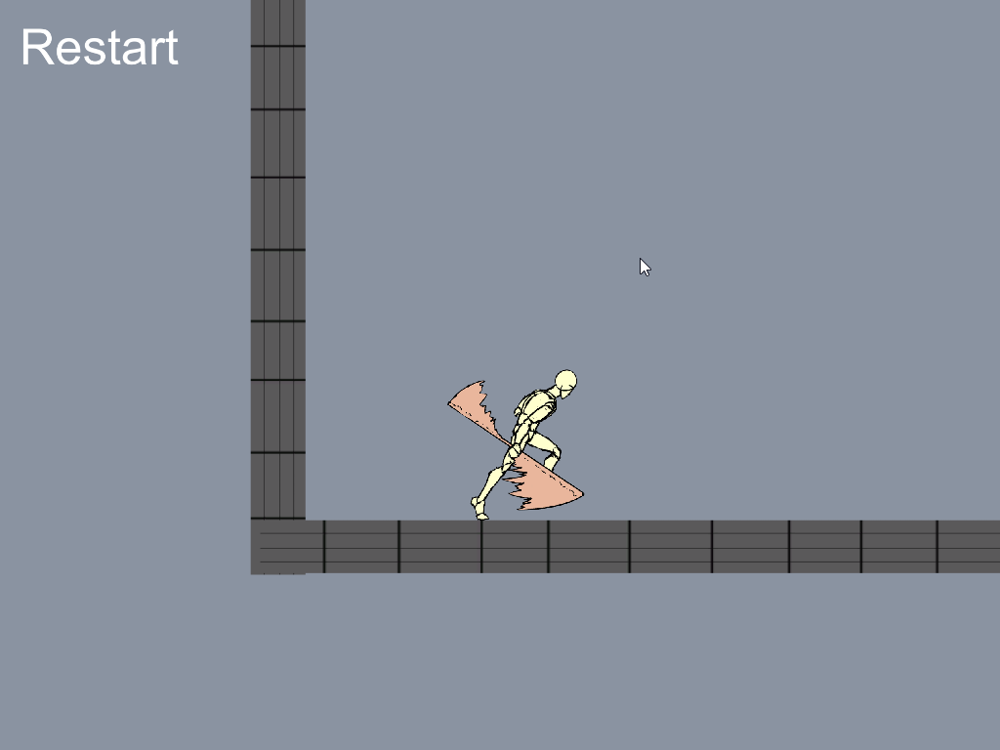
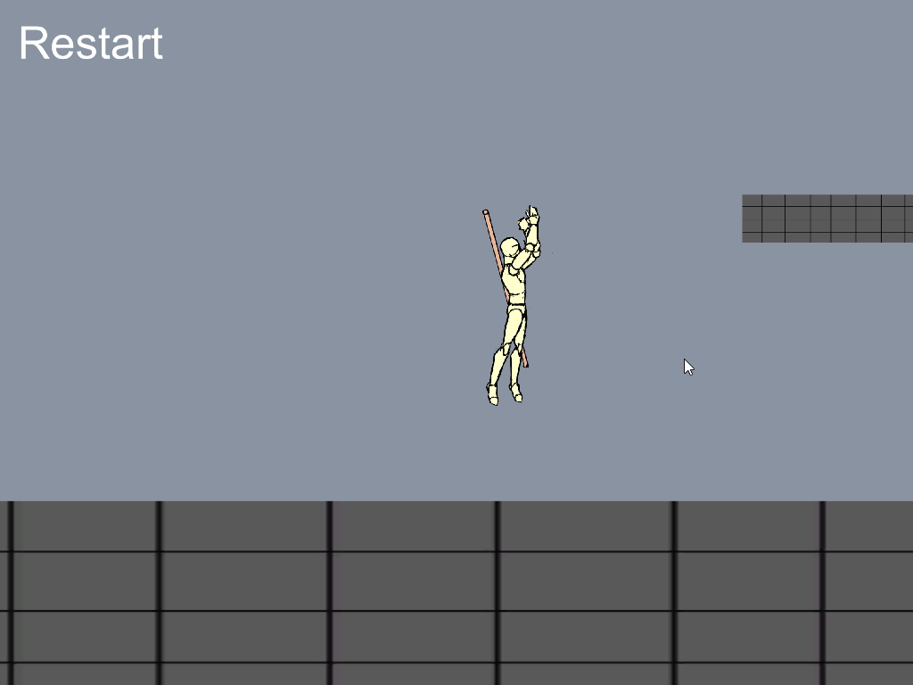
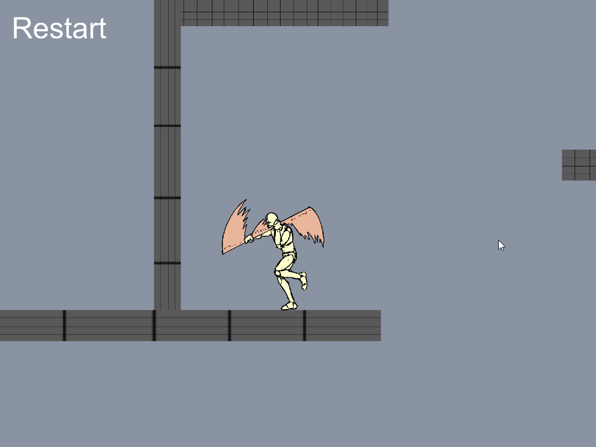

# Unity2DcharacterController

This is a small tech project I did for university. It's a small sandbox with a 2d humanoid playable character that can perform basic movement and actions. I coded collision, control and created graphics and animation assets by hand to create a controller to test my ability to make a natural and entertaing 2d controller. 
The stimulus for this project was the fact that the majority of beginner video game developers who work on Unity Engine focus on programming logic for three-dimensional games and as a result there are more resources for creating 3D games, even though the engine supports two-dimensional logic and with proper mindset opens a door for a lot of artistic possibilities.

<picture>
  
</picture>
<picture>
  
</picture>
<picture>
  
</picture>

## Controls
- MOVEMENT - A(left), D(right)
- JUMP - Spacebar
- SHEATHE/UNSHEATHE - F

  Note: jumping is disabled when the weapon is out
